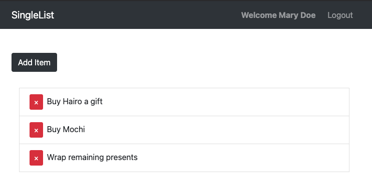

<h1> SingleList </h1>
  

<h2> Summary </h2>

  - [About the Project](#about-the-project)
  - [Usage](#usage)
  - [Videos and Screenshots](#videos-and-screenshots)
  - [Getting Started](#getting-started)
  - [Built With](#built-with)
  - [Contributing](#contributing)
  - [Authors](#authors)
  - [Acknowledgments](#acknowledgments)

## About the Project

- If you ever find yourself needing to make a quick and easy todo list for any occasion, whether it is going to the grocery store or remebering daily task, use SingleList! Make your list on the go, using your mobile device or at home, on your laptop or computer.

## Usage

- SinlgeList allows you to track a simple and straight forward todo list, while also keeping your list secured. You can create an authenticated account and log in wise ease from your mobile device, desktop or laptop while keeping your list up to date across all platforms. You also have the option to view your todo list without a need to login if you're truly on the go.

## Videos and Screenshots

## Getting Started
- To begin using the site, you can register a new account, log into an existing account, or views existing todo items. 

## Built With
  - [Javascript](https://www.javascript.com/)
  - [ReactJS](https://reactjs.org/)
  - [Redux](https://redux.js.org/)
  - [NodeJS](https://nodejs.org/en/)
  - [ExpressJS](https://expressjs.com/)
  - [MongoDB](https://www.mongodb.com/)
  - [Mongoose](https://mongoosejs.com/)
  - [JWT](https://jwt.io/)
  - [Heroku](https://www.heroku.com/)
  - [HTML](https://html.spec.whatwg.org/)
  - [CSS](https://www.w3.org/Style/CSS/Overview.en.html)
  - [Bootstrap](https://getbootstrap.com/)

## Authors

  - **Jonathan Nuno** - [Jonathan-Nuno](https://github.com/Jonathan-Nuno)

## Acknowledgments

  - **Nathan Orris** - *The Certified* - **DiR at DigitalCrafts Houston** -
    [NathanNoSudo](https://github.com/NathanNoSudo)
